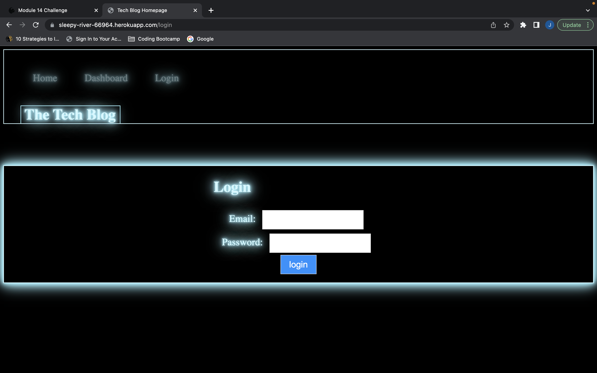

# Tech-Blog

## Description

This is a full-stack application deployed using heroku designed to function as a Tech Blog where users can either sign up or login to view posts by other developers and make comments on those posts. They can also create their own posts. While developing this application I learned how to use the MVC Paradigm to create an organized application that resembles a real-world application. This app is currently not fully functional but will be with further maintenance. 

## Table of Contents 

- [Installation](#installation)
- [Usage](#usage)
- [Credits](#credits)
- [License](#license)

## Installation

npm install 

## Usage

Currently does not function fully but will work on.

[Tech Blog Link](https://sleepy-river-66964.herokuapp.com/)

## Credits

N/A

## License

N/A

